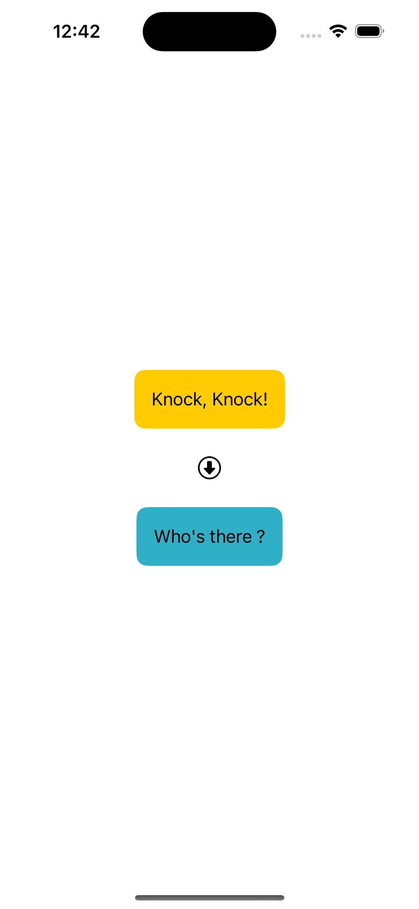
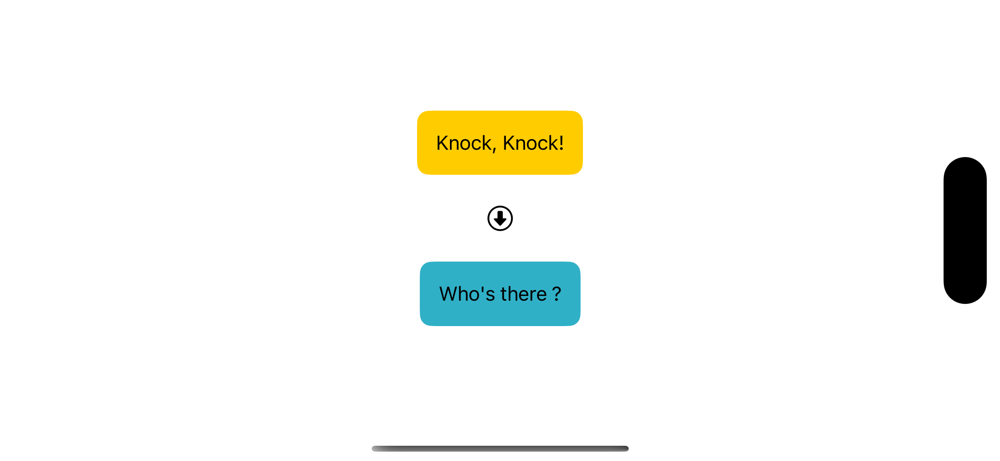
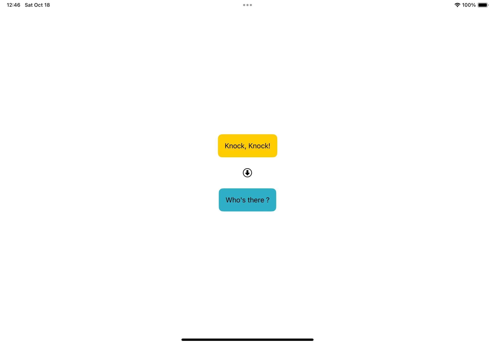

# Lab01 – Hello SwiftUI Weerasinghe T T A - IT22170552

## 💻 Exercise Overview

This lab exercise was based on the **Hello SwiftUI** tutorial from Apple's official developer documentation:

🔗 [Hello SwiftUI Tutorial](https://developer.apple.com/tutorials/develop-in-swift/hello-swiftui)

The main objective was to get familiar with the SwiftUI framework and Xcode by following the guided tutorial. The tutorial walks through:

- Creating a new SwiftUI-based iOS app in Xcode.
- Structuring a simple UI using SwiftUI views like `Text`, `VStack`, and `Image`.
- Running the app on iPhone and iPad simulators.

---

## 🧠 What I Did

- Followed the entire tutorial using Xcode.
- Created the SwiftUI project and built a basic interface.
- Tested the app in both iPhone and iPad simulators.
- Captured screenshots of the running app.
- Committed all the code and screenshots to this repository.

---

## 📸 Screenshots

### iPhone Simulator

### iPad Simulator

---

## 🚀 How to Run

To run this project:

1. Open the `.xcodeproj` or `.xcodeworkspace` file in Xcode.
2. Select an iOS Simulator (iPhone or iPad).
3. Build and run the project (`Cmd + R`).

---

## ✅ Submission Checklist

- [x] Code saved and pushed to GitHub.
- [x] Two screenshots each from iPhone and iPad simulators.
- [x] README file created with summary and images.

