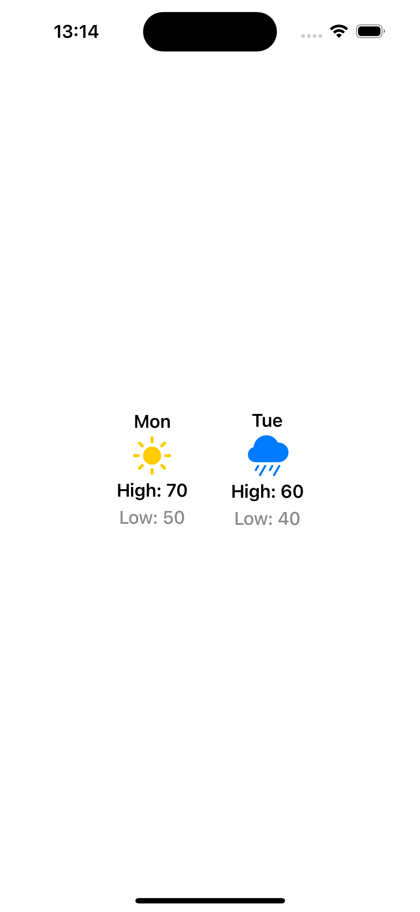
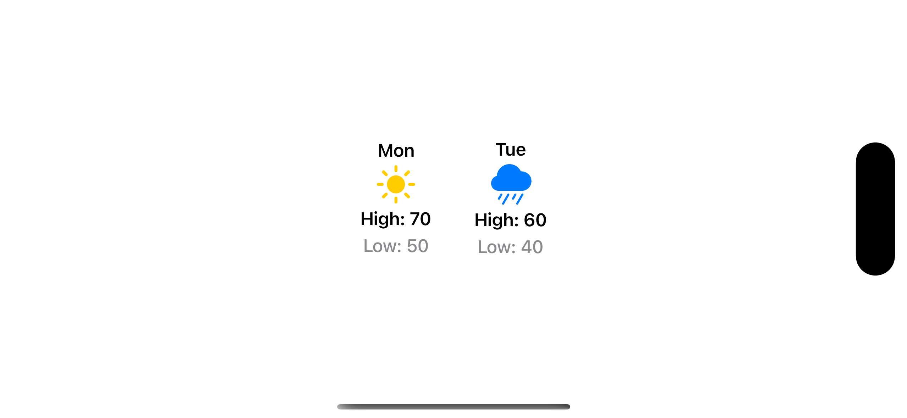
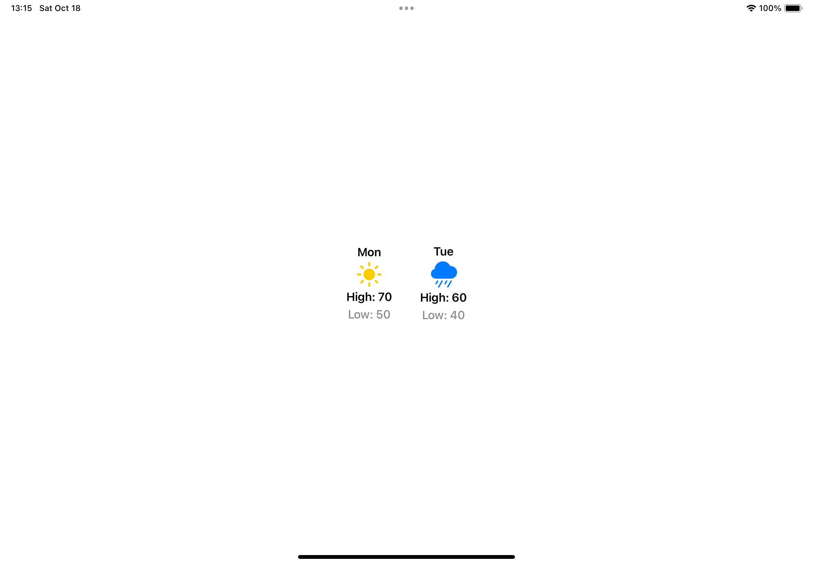

# Exercise 02 - Customize Views with Properties

This project follows the Apple Developer tutorial:  
[Customize Views with Properties](https://developer.apple.com/tutorials/develop-in-swift/customize-views-with-properties)

## 📱 iPhone Simulator Screenshots

| iPhone Screenshot 1 | iPhone Screenshot 2 |
|---------------------|---------------------|
|  |  |

## 📱 iPad Simulator Screenshots

| iPad Screenshot 1 | iPad Screenshot 2 |
|-------------------|-------------------|
|  |  |

## 🧑‍💻 What I Learned

- How to use **properties** to customize SwiftUI views.
- How to bind state to dynamically update views in SwiftUI.
- Experience with **running and testing the app** on both **iPhone** and **iPad simulators**.
